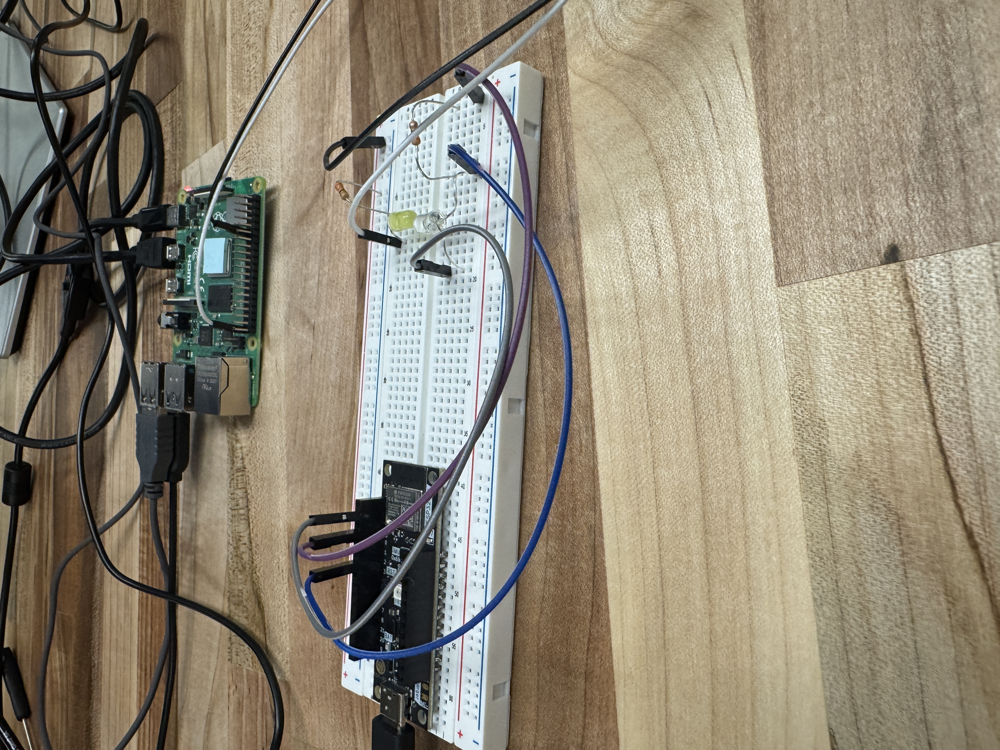

# Morse Code Transceiver System
**Author: Noah Laforet**

A Morse code communication system featuring optical transmission between a Raspberry Pi and ESP32-C3 microcontroller. This project demonstrates embedded systems programming, real-time signal processing, and precise timing control.

## Project Overview

This system enables wireless optical communication by encoding text messages into Morse code, transmitting them via LED, and decoding them using a photodiode sensor. The project showcases both standard and high-speed transmission modes, demonstrating the impact of timing optimization on data throughput.

### Key Features

- **Optical Communication**: Raspberry Pi transmits, ESP32-C3 receives and decodes
- **Dual Speed Modes**:
  - Standard Mode: 200ms dot duration
  - Fast Mode: 10ms dot duration (10 characters/second)
- **Real-Time Decoding**: State machine-based signal processing
- **High-Precision Timing**: Microsecond-level timing control using ESP32 hardware timers
- **Analog Signal Processing**: ADC-based photodiode reading with calibration

## Hardware Requirements

### Transmitter (Raspberry Pi)
- Raspberry Pi (any model with GPIO)
- LED (connected to GPIO pin 17)
- Current-limiting resistor (220-330Ω)
- Power supply


### Receiver (ESP32-C3)
- ESP32-C3 development board (or UNO32 with ESP32-C3)
- Photodiode sensor module
- USB cable for programming and power





## Software Setup

### Prerequisites

**Raspberry Pi:**
- Python 3.x
- RPi.GPIO library
  ```bash
  sudo apt-get update
  sudo apt-get install python3-rpi.gpio
  ```

**ESP32-C3:**
- ESP-IDF v5.0 or later ([Installation Guide](https://docs.espressif.com/projects/esp-idf/en/latest/esp32c3/get-started/))
- ESP32-C3 target configured in ESP-IDF

### Building the Receiver Firmware

#### Standard Mode (200ms dot duration)
```bash
cd receiver-standard
idf.py set-target esp32c3
idf.py build
idf.py -p /dev/ttyUSB0 flash monitor
```

#### Fast Mode (10ms dot duration, 10 chars/sec)
```bash
cd receiver-fast
idf.py set-target esp32c3
idf.py build
idf.py -p /dev/ttyUSB0 flash monitor
```

To exit the monitor, press `Ctrl-]`

## Usage

### Running the Transmitter

**Standard Mode (200ms dot):**
```bash
cd transmitter/src
sudo python3 morse_transmitter.py <repetitions> <message>
```

**Fast Mode (10ms dot):**
```bash
cd transmitter/src
sudo python3 morse_transmitter_fast.py <repetitions> <message>
```

#### Examples

Send "HELLO" 3 times:
```bash
sudo python3 morse_transmitter.py 3 "HELLO"
```

Send "SOS ESP32" once at high speed:
```bash
sudo python3 morse_transmitter_fast.py 1 "SOS ESP32"
```

Send message with spaces:
```bash
sudo python3 morse_transmitter.py 2 "HELLO WORLD"
```

### Expected Output

**Transmitter (Raspberry Pi):**
```
Sending message 'HELLO' 1 time(s)
Morse code pattern:
.... . .-.. .-.. ---
Transmission complete!
```

**Receiver (ESP32-C3):**
```
I (500) MORSE_RECEIVER: Morse Code Receiver Ready - Waiting for signal on GPIO2...
I (510) MORSE_RECEIVER: Starting Morse code detection...
I (1200) MORSE_RECEIVER: Dot detected (210 ms)
I (1450) MORSE_RECEIVER: Dot detected (195 ms)
I (1700) MORSE_RECEIVER: Dot detected (205 ms)
I (1950) MORSE_RECEIVER: Dot detected (198 ms)
I (2600) MORSE_RECEIVER:   → Decoded: '....' = 'H'
I (2850) MORSE_RECEIVER: Dot detected (202 ms)
I (3500) MORSE_RECEIVER:   → Decoded: '.' = 'E'
...
I (8000) MORSE_RECEIVER: ================================
I (8000) MORSE_RECEIVER:    Transmission Complete!
I (8000) MORSE_RECEIVER: ================================
I (8000) MORSE_RECEIVER: Output: HELLO
I (8000) MORSE_RECEIVER: ================================
```

## Project Structure

```
morse-code-transceiver/
├── README.md                          # This file
├── transmitter/                       # Raspberry Pi transmitter
│   └── src/
│       ├── morse_transmitter.py       # Standard mode (200ms)
│       └── morse_transmitter_fast.py  # Fast mode (10ms)
├── receiver-standard/                 # ESP32 receiver - Standard mode
│   ├── CMakeLists.txt
│   └── main/
│       ├── CMakeLists.txt
│       └── morse_receiver_standard.c
└── receiver-fast/                     # ESP32 receiver - Fast mode
    ├── CMakeLists.txt
    └── main/
        ├── CMakeLists.txt
        └── morse_receiver_fast.c
```

## Technical Implementation Details

### Morse Code Timing Standards

Both transmitter and receiver implement the standard Morse timing ratios:
- **Dot**: 1 unit (200ms standard, 10ms fast)
- **Dash**: 3 units
- **Intra-character gap**: 1 unit
- **Inter-character gap**: 3 units
- **Word gap**: 7 units

### State Machine Design (Receiver)

The receiver implements a timing-based state machine:

1. **Rising Edge Detection**: Light turns ON → Check gap duration
   - If gap ≥ 7 units: Word boundary detected, add space
   - If gap ≥ 3 units: Letter boundary detected, decode buffer

2. **Falling Edge Detection**: Light turns OFF → Measure pulse duration
   - If duration ≥ 2 units: Classify as DASH
   - If duration ≥ 0.5 units: Classify as DOT
   - Add symbol to buffer

3. **Timeout Handling**: If idle for 3+ units, decode current buffer

### ADC Sampling and Calibration

- **ADC Resolution**: 12-bit (0-4095)
- **Voltage Range**: 0-3.3V (using 12dB attenuation)
- **Calibration**: Curve-fitting or line-fitting scheme based on eFuse data
- **Threshold**: 80 ADC units (tuned for photodiode characteristics)
- **Sampling Rate**: 10ms (standard mode), 1ms (fast mode)

### Clock Cycle Optimization

**Fast Mode Performance:**
- Reduced dot duration from 200ms → 10ms (20x faster)
- Increased sampling rate from 10ms → 1ms (10x faster)
- Achieves ~10 characters/second throughput
- Requires precise FreeRTOS task scheduling to avoid watchdog timeouts

## Troubleshooting

### Receiver Not Detecting Signal
- Check photodiode alignment with LED
- Verify GPIO2 connection to photodiode signal pin
- Adjust `LIGHT_THRESHOLD` in source code if ambient light interferes. Covering circuit will help improve accuracy
- Ensure transmitter and receiver are using matching speed modes

### Incorrect Decoding
- Verify timing synchronization between transmitter and receiver
- Check for consistent power supply to both devices
- Ensure photodiode has clear line-of-sight to LED
- Try reducing transmission speed (use standard mode)

### Watchdog Timer Resets (Fast Mode)
- Increase `SAMPLE_RATE_MS` in receiver code
- Ensure `vTaskDelay()` is called with at least 1 tick

## Technical Skills Demonstrated

### Embedded Systems Programming
- **C Programming**: Low-level embedded C for ESP32-C3 firmware
- **Python**: GPIO control and timing for Raspberry Pi transmitter
- **FreeRTOS**: Real-time operating system task management
- **ESP-IDF Framework**: ESP32 development with industry-standard tooling

### Hardware Interfacing
- **GPIO Control**: Digital I/O for LED transmission on Raspberry Pi
- **ADC (Analog-to-Digital Conversion)**: 12-bit ADC reading for photodiode signal detection
- **ADC Calibration**: eFuse-based calibration for accurate voltage measurements
- **Photodiode Sensor Integration**: Optical signal reception and amplification

### Real-Time Signal Processing
- **State Machine Design**: Edge detection and timing-based decoding
- **Precise Timing Control**:
  - ESP32 high-resolution timer (`esp_timer`) with microsecond accuracy
  - FreeRTOS `vTaskDelay()` for controlled sampling rates
  - Raspberry Pi GPIO timing with Python `time.sleep()`
- **Signal Debouncing**: Threshold-based noise filtering
- **Pattern Recognition**: Morse code lookup table implementation

### Performance Optimization
- **Clock Cycle Management**: Optimized sampling rates (1ms and 10ms)
- **Watchdog Timer Handling**: Proper FreeRTOS task yielding to prevent system resets
- **Memory Management**: Efficient buffer handling for real-time decoding
- **Timing Optimization**: 20x speed increase from standard to fast mode

### System Integration
- **Cross-Platform Communication**: Raspberry Pi ↔ ESP32-C3 optical link
- **Protocol Design**: Synchronized timing parameters between transmitter and receiver
- **Build System**: CMake-based ESP-IDF project configuration
- **Version Control**: Git-based project management

## Future Enhancements

- Bidirectional communication (ESP32 transmits back to Pi)
- Error detection and correction (checksums)
- Variable speed auto-negotiation
- GUI for message input and display
- Multi-channel communication using RGB LEDs

## License

This project is open source and available for educational purposes.

---

**Author**: Noah Laforet
**Hardware**: Raspberry Pi, ESP32-C3 (UNO32)
**Technologies**: Python, C, FreeRTOS, ESP-IDF, ADC, GPIO, Real-Time Systems
